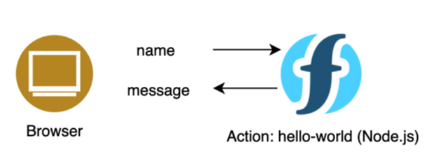

# Getting Started with Serverless

This tutorial is aimed at people with limited knowledge of coding and cloud computing, but interested in getting their first program up and running on the cloud. It is based on *serverless* computing and all steps are done on [IBM Cloud](https://cloud.ibm.com/) (you need to [register](https://cloud.ibm.com/registration) first) using *IBM Cloud Functions*, which is based on the Open Source programming service [OpenWhisk](https://github.com/apache/openwhisk).

This tutotial contains 3 steps to create a simple program (also called function in serverless computing and action in Openwhisk). The way actions work is actually straightforward: they take some input parameters, process them and return something, e.g. a response message. 

Several programming labguages are supported. In our case a Node.js function takes a string (a name) and returns a **Hello, 'name'** message.
  
## Hello World

In the first step we want to get on the IBM Cloud and start an action: 

- go to *[IBM Cloud Functions](https://cloud.ibm.com/functions/)*
- click on *[Actions](https://cloud.ibm.com/functions/actions)*
- click on the blue *[Create](https://cloud.ibm.com/functions/create/action)* button
- enter an *Action Name*, e.g. *hello-world-web-action*
- click on *Create*
- click on *Invoke*, you should see the result:
~~~~
Results:

{
  "message": "Hello World"
}	
~~~~

Congratulations!

## Using Parameters
The next steps is to process an input value (parameter) and return an output depending on the input parameter. If we provide a parameter value, we are greeted. Otherwise we get an error message.

- scroll up and replace the code with
~~~~
function main({name}) {
 var msg = 'You did not tell me who you are.';
 if (name) {
   msg = `Hello, ${name}!`
 }
 return {msg}
}
~~~~
- Click on *Save* and *Invoke*; we did not provide a parameter so far, the initial value of *msg is returned:
~~~~
{
  "msg": "You did not tell me who you are."
}
~~~~
- scroll up and click on *Change Input*
- replace the content with `{ "name": "Hans"}`
- click on *Save* and *Invoke*; as we provided the name parameter, it is returned by this action as part of the variable *msg*:
~~~~
{
  "msg": "Hello, Hans!"
}
~~~~

## Turning this Action into a Web Action
Up until now the action can be used by other services on the IBM Cloud, but it is not accessible to other programs elsewehere or to users who want to invoke the action with there internet browser. THere's only two things to do:
- replace the line
~~~~
 return {msg}
~~~~
with this line
~~~~
 return {body: `<html><body><h3>${msg}</h3></body></html>`}
~~~~
This modifies the return value slightly so it contains a valid HTML syntax that can be processed by a web browser

Now expose the action by defining it as a web action so it gets a URL:
- click om *Endpoints* on the left,
- click on *Enable as Web Action*,
- click on *Save*,
- copy the web action's URL (e.g. https://eu-de.functions.cloud.ibm.com/api/v1/web/a7200a8d-610b-4b00-9e58-05d850355555/brownbag/hello-world-web-action) into the clipboard and paste it into the *Address Bar* of the browser; the result is again `You did not tell me who you are.`.

We again need a parameter that we add to the URL:
- enter  https://eu-de.functions.cloud.ibm.com/api/v1/web/a7200a8d-610b-4b00-9e58-05d850355555/brownbag/hello-world-web-action?name=Otto into the address bar and hit Enter
The result is:
~~~~
Hello, Otto!
~~~~

References:
- https://cloud.ibm.com/docs/openwhisk?topic=cloud-functions-actions_web
